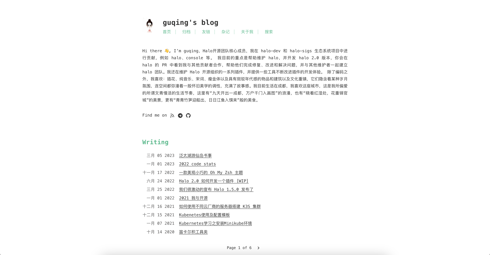
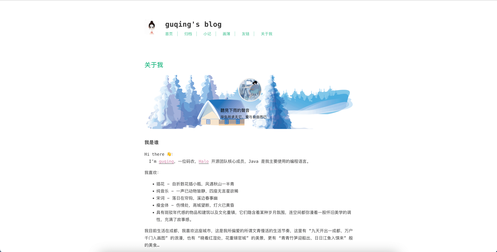
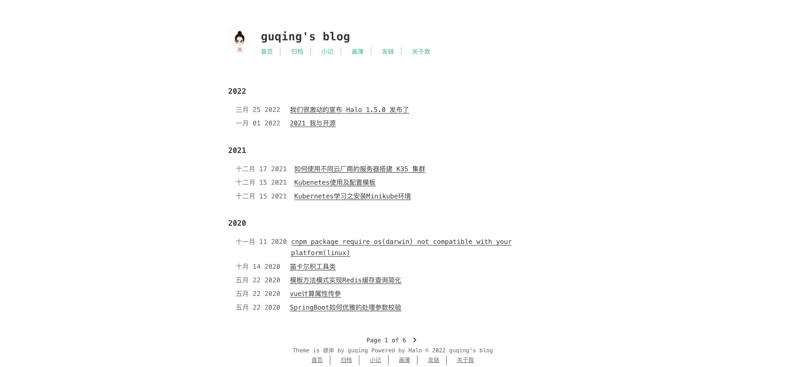

# halo-theme-higan

## 说明

该主题的原作者为 Pieter Robberechts，非常感谢做出这么优秀的主题。

原主题地址：[hexo-theme-cactus](https://github.com/probberechts/hexo-theme-cactus.git)

全局搜索功能需要先安装插件: [plugin-search-widget](https://github.com/halo-sigs/plugin-search-widget)

## 预览截图

## 使用方法

1. 到 [Release](https://github.com/guqing/halo-theme-higan/releases) 下载适用于 Halo 的主题版本。
2. 在 Console 端的主题菜单直接上传安装即可使用。

## 迁移

适用于 Halo 1.x 版本的主题位于分支 [halo-theme-higan 1.x](https://github.com/guqing/halo-theme-higan/tree/1.x)

当前 main 分支适用于 Halo 2.0 版本
